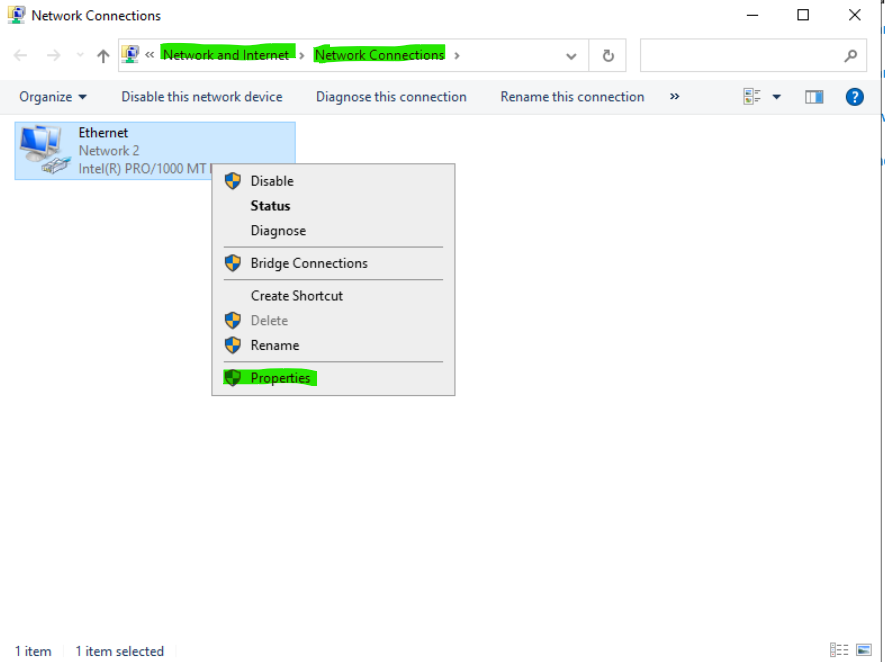
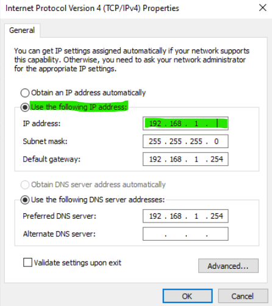

# Documentation du Projet de Gestion de Tâches à Distance via Script

## Prérequis Techniques

### Matériel
- Machines distantes connectées sur le même réseau.
- Machine locale pour l'exécution des scripts.

### Logiciel
- **Systèmes d'exploitation** :
  - OS : Windows Server
  - Version : 2022
  - OS : Windows 
  - Version : 10
- **Langages de script** :
  - Powershell
  - Bash
- **Outils et dépendances** :
  - OpenSSH (pour les connexions SSH)
  - Git (pour le contrôle de version)
  - 
- **Permissions** :
  - Accès administrateur sur les machines distantes pour exécuter certaines tâches.

## Étapes d'Installation et de Configuration

### 1. Préparation de l'Environnement

#### a. Configurations des clients

- Client Windows 10 
- Nom : CLIWIN01
- Compte utilisateur : wilder (dans le groupe des admins locaux)
- Mot de passe : Azerty1*
- Adresse IP fixe : 192.168.1.40

 #### b. Configurations des serveurs
 
- Serveur Windows Server 2022 :
- Nom : SRVWIN01
- Compte : Administrator (dans le groupe des admins locaux)
- Mot de passe : Azerty1*
- Adresse IP fixe : 192.168.1.43
  
 #### c. Configurations des adresses IP fixe pour la mise en réseau

 - Configuration de l'IP statique sur Windows Server et Windows 10 en interface graphique

1. **Ouvrir le Centre Réseau et Partage :**
   - Cliquez sur l'icône réseau dans la barre des tâches.
   - Sélectionnez "Centre Réseau et partage".

2. **Modifier les paramètres de l'adaptateur :**
   - Dans le panneau de gauche, cliquez sur "Modifier les paramètres de la carte".

3. **Sélectionner l'adaptateur réseau :**
   - Faites un clic droit sur l'adaptateur réseau que vous souhaitez configurer.
   - Sélectionnez "Propriétés".
     

4. **Configurer TCP/IPv4 :**
   - Dans la liste, sélectionnez "Protocole Internet version 4 (TCP/IPv4)".
   - Cliquez sur "Propriétés".
  

5. **Entrer les informations IP :**
   - Sélectionnez "Utiliser l'adresse IP suivante".
   - Entrez l'adresse IP : `192.168.1.40`. pour le Windows client et `192.168.1.43` pour le Windows Server
   - Masque de sous-réseau : `255.255.255.0` 
   - Passerelle par défaut : entrez l'adresse IP de votre routeur (par exemple, `192.168.1.254`).

6. **Configurer les serveurs DNS :**
   - Serveurs DNS préféré  `192.168.1.254` 

7. **Valider les paramètres :**
   - Cliquez sur "OK" pour fermer les fenêtres de propriétés.
   - Cliquez sur "Fermer" pour terminer la configuration.

 #### d. Configurations des pare-feu pour la connectivité
## Pour Windows

1. **Ouvrir le Pare-feu Windows avec fonctions avancées de sécurité :**
   - Cliquez sur le bouton Démarrer et tapez "Pare-feu Windows avec fonctions avancées de sécurité".
   - Cliquez sur l'application correspondante pour l'ouvrir.

2. **Créer une règle entrante pour ICMP :**
   - Dans le panneau de gauche, cliquez sur "Règles de trafic entrant".
   - Dans le panneau de droite, cliquez sur "Nouvelle règle...".
   - Sélectionnez "Personnalisée" et cliquez sur "Suivant".
   - Sélectionnez "Tous les programmes" et cliquez sur "Suivant".
   - Sélectionnez "Type de protocole" et choisissez "ICMPv4" dans le menu déroulant.
   - Cliquez sur "Suivant".
   - Sélectionnez "Adresse IP source" pour définir les adresses spécifiques ou laissez "Toutes les adresses" pour permettre les pings de n'importe quelle source.
   - Cliquez sur "Suivant".
   - Sélectionnez "Autoriser la connexion".
   - Cliquez sur "Suivant".
   - Choisissez les profils pour lesquels cette règle s'applique (Domaine, Privé, Public).
   - Cliquez sur "Suivant".
   - Donnez un nom à la règle (par exemple, "Autoriser ICMPv4 Entrant") et cliquez sur "Terminer".

