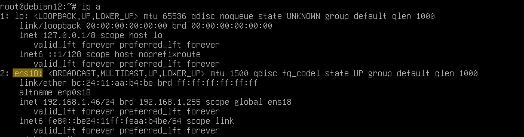
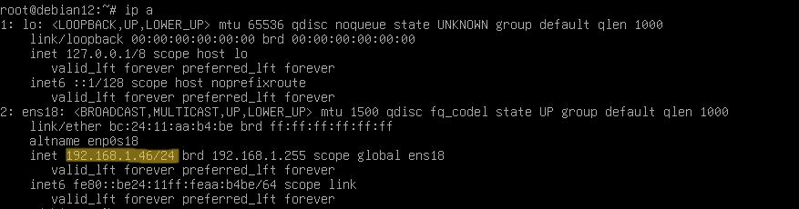

# Changer l'adresse IP sur Debian Linux

## Prérequis techniques

- Accès à un terminal sur la machine Debian
- Privilèges administratifs (accès root ou sudo)
- Nom de l'interface réseau : `ens18` *(selon le nom de votre interface réseau)*
- Adresse IP fixe souhaitée : `192.168.1.x` *(x c'est le nombre que vous voulez pour l'adresse IP)*
- Masque de sous-réseau : `255.255.255.0`
- Passerelle : `192.168.1.254`
- Serveurs DNS : `192.168.1.254`

## Étapes d'installation et de configuration

### 1. Ouvrir une session avec des privilèges administratifs

Ouvrez un terminal et passez en mode superutilisateur ou utilisez sudo pour chaque commande.

2. Identifier le nom de l'interface réseau
Vérifiez le nom de l'interface réseau (ici, nous supposons que c'est ens18 ).
`ip a`

Le nom de votre interface réseau (surligné en jaune) :

4. Modifier le fichier de configuration réseau
Éditez le fichier /etc/network/interfaces.
`nano /etc/network/interfaces`

Ajoutez ou modifiez les lignes suivantes pour configurer votre interface réseau (ens18 dans cet ex)  avec une adresse IP fixe.

- auto ens18
- iface ens18 inet static
- address 192.168.1.x
- netmask 255.255.255.0
- gateway 192.168.1.254
- dns-nameservers 192.168.1.254

4. Enregistrer et fermer le fichier
Pour enregistrer et fermer le fichier dans nano :

*Appuyez sur Ctrl + O puis Enter pour enregistrer.
Appuyez sur Ctrl + X pour quitter l'éditeur.*

5. Redémarrer le service réseau
Redémarrez le service réseau pour appliquer les modifications.
`systemctl restart networking`
6. Vérifier la nouvelle configuration IP
Vérifiez que l'adresse IP a été mise à jour correctement.
`ip a`

