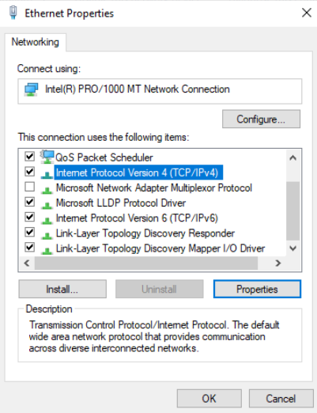

# Documentation du Projet de Gestion de Tâches à Distance via Script

## Prérequis Techniques

### Matériel
- Machines distantes connectées sur le même réseau.
- Machine locale pour l'exécution des scripts.

### Logiciel
- **Systèmes d'exploitation** :
  
#### Les Serveurs

| **Système**       | **Debian 12.5**  | **Windows Server 2022**  |
|-------------------|------------------|--------------------------|
| **HostName**      | SRVLX01          | SRVWIN01                 |
| **Login**         | root             | administrator            |
| **Password**      | Azerty1*         | Azerty1*                 |
| **IP Fixe**       | 172.16.10.46/24  | 172.16.10.40/24           |
| **Spécificité**   | Bash shell 5.2.21             | Powershell Core 7.4 LTS inclus |

#### Les Clients

| **Système**          | **Ubuntu 22.04 LTS 01** | **Windows 10** | 
|----------------------|-------------------------|-------------------------|
| **HostName**         | CLILIN01                | CLIWIN01                | 
| **Login**            | wilder                  | wilder                  | 
| **Password**         | Azerty1*                | Azerty1*                | 
| **IP Fixe**          | 172.16.10.45/24         | 172.16.10.43/24         |

- **Outils et dépendances** :
  - OpenSSH (pour les connexions SSH)
  - Git (pour le contrôle de version)
- **Permissions** :
  - Accès administrateur sur les machines distantes pour exécuter certaines tâches.

## Étapes d'Installation et de Configuration

### 1. Préparation de l'Environnement

 #### a. Configurations des adresses IP fixe pour la mise en réseau  
 
#### Sur Windows :
 - Configuration de l'IP statique en interface graphique

1. **Ouvrir le Centre Réseau et Partage :**
   - Cliquez sur l'icône réseau dans la barre des tâches.
   - Sélectionnez "Centre Réseau et partage".

2. **Modifier les paramètres de l'adaptateur :**
   - Dans le panneau de gauche, cliquez sur "Modifier les paramètres de la carte".

3. **Sélectionner l'adaptateur réseau :**
   - Faites un clic droit sur l'adaptateur réseau que vous souhaitez configurer.
   - Sélectionnez "Propriétés".
     


4. **Configurer TCP/IPv4 :**
   - Dans la liste, sélectionnez "Protocole Internet version 4 (TCP/IPv4)".
   - Cliquez sur "Propriétés".
  


5. **Entrer les informations IP :**
   - Sélectionnez "Utiliser l'adresse IP suivante".
   - Entrez l'adresse IP : `192.168.1.40`. pour le Windows client et `192.168.1.43` pour le Windows Server
   - Masque de sous-réseau : `255.255.255.0` 
   - Passerelle par défaut : entrez l'adresse IP de votre routeur (par exemple, `192.168.1.254`).

6. **Configurer les serveurs DNS :**
   - Serveurs DNS préféré  `192.168.1.254` 


7. **Valider les paramètres :**
   - Cliquez sur "OK" pour fermer les fenêtres de propriétés.
   - Cliquez sur "Fermer" pour terminer la configuration.
  
### Pour Linux : Serveur DEBIAN

### 1. Ouvrir une session avec des privilèges administratifs

#### Ouvrez un terminal et passez en mode superutilisateur ou utilisez sudo pour chaque commande.


#### 2. Identifier le nom de l'interface réseau

- Vérifiez le nom de l'interface réseau (ici, nous supposons que c'est ens18 ).

`ip a`

- Le nom de votre interface réseau (surligné en jaune) :


4. Modifier le fichier de configuration réseau
Éditez le fichier /etc/network/interfaces.
`nano /etc/network/interfaces`

Ajoutez ou modifiez les lignes suivantes pour configurer votre interface réseau (ens18 dans cet ex)  avec une adresse IP fixe.

- auto ens18
- iface ens18 inet static
- address 192.168.1.x
- netmask 255.255.255.0
- gateway 192.168.1.254
- dns-nameservers 192.168.1.254

4. Enregistrer et fermer le fichier
Pour enregistrer et fermer le fichier dans nano :

*Appuyez sur Ctrl + O puis Enter pour enregistrer.
Appuyez sur Ctrl + X pour quitter l'éditeur.*

5. Redémarrer le service réseau
Redémarrez le service réseau pour appliquer les modifications.
`systemctl restart networking`
6. Vérifier la nouvelle configuration IP
Vérifiez que l'adresse IP a été mise à jour correctement.
`ip a`


### Pour Linux : Client Ubuntu

### Ouvrir le fichier de configuration Netplan :

- Le fichier de configuration Netplan se trouve généralement dans le répertoire /etc/netplan/.
- Listez les fichiers dans ce répertoire pour identifier le fichier de configuration :

```ls /etc/netplan/```

### Ouvrez le fichier de configuration (par exemple, 01-netcfg.yaml) avec un éditeur de texte :

```sudo nano /etc/netplan/01-netcfg.yaml```

#### Modifier les paramètres réseau :

- Localisez la section ethernets et modifiez-la pour définir une adresse IP statique. Voici un exemple de configuration :

`
yaml
network:
  version: 2
  ethernets:
    eth0:
      dhcp4: no
      addresses: [192.168.1.100/24]
      gateway4: 192.168.1.1
      nameservers:
        addresses: [8.8.8.8, 8.8.4.4]
`

- Remplacez `eth0` ar le nom de votre interface réseau (vous pouvez trouver le nom de l'interface en utilisant la commande `ip a`).
- Remplacez `192.168.1.100/24` par l'adresse IP et le masque de sous-réseau que vous souhaitez utiliser.
- Remplacez `192.168.1.1` par l'adresse IP de la passerelle (gateway).
- Remplacez `8.8.8.8`, `8.8.4.4` par les adresses IP des serveurs DNS que vous souhaitez utiliser.
- Appliquer les modifications :

`sudo netplan apply`

Vérification
Vérifier la nouvelle adresse IP :

`ip a`

- Assurez-vous que l'adresse IP a été correctement modifiée.

 #### b. Configurations des pare-feu pour la connectivité
### Pour Windows

1. **Ouvrir le Pare-feu Windows avec fonctions avancées de sécurité :**
   - Cliquez sur le bouton Démarrer et tapez "Pare-feu Windows avec fonctions avancées de sécurité".
   - Cliquez sur l'application correspondante pour l'ouvrir.

2. **Créer une règle entrante pour ICMP :**
   - Dans le panneau de gauche, cliquez sur "Règles de trafic entrant".
   - Dans le panneau de droite, cliquez sur "Nouvelle règle...".
   - Sélectionnez "Personnalisée" et cliquez sur "Suivant".
   - Sélectionnez "Tous les programmes" et cliquez sur "Suivant".
   - Sélectionnez "Type de protocole" et choisissez "ICMPv4" dans le menu déroulant.
   - Cliquez sur "Suivant".
   - Sélectionnez "Adresse IP source" pour définir les adresses spécifiques ou laissez "Toutes les adresses" pour permettre les pings de n'importe quelle source.
   - Cliquez sur "Suivant".
   - Sélectionnez "Autoriser la connexion".
   - Cliquez sur "Suivant".
   - Choisissez les profils pour lesquels cette règle s'applique (Domaine, Privé, Public).
   - Cliquez sur "Suivant".
   - Donnez un nom à la règle (par exemple, "Autoriser ICMPv4 Entrant") et cliquez sur "Terminer".
  
### Sur le Serveur Debian

1. **Vérifier l'état du pare-feu** : Assurez-vous que le pare-feu est installé et actif. Par défaut, sur Debian, cela peut être `iptables` ou `nftables`. Vérifiez avec la commande :
    
    
    `sudo iptables -L`
    
2. **Autoriser le trafic ICMP entrant** : Si vous utilisez `iptables`, vous pouvez autoriser le trafic ICMP entrant en ajoutant une règle. Par exemple, pour autoriser les requêtes ICMP echo (ping) :
    
    
    `sudo iptables -A INPUT -p icmp --icmp-type echo-request -j ACCEPT`
    
3. **Sauvegarder les règles** (optionnel mais recommandé) : Pour sauvegarder vos règles `iptables` de manière persistante, vous pouvez installer `iptables-persistent` :

    
    `sudo apt-get update sudo apt-get install iptables-persistent`
    
    Suivez les instructions pour sauvegarder vos règles actuelles.
    

### Sur le Client Ubuntu

1. **Vérifier l'état du pare-feu** : De même, assurez-vous que le pare-feu est activé sur le client Ubuntu. Par défaut, Ubuntu utilise `ufw` (Uncomplicated Firewall).
    
2. **Configurer UFW pour autoriser le trafic ICMP** :
    
    - Si `ufw` n'est pas installé, installez-le avec :
        
        
        `sudo apt-get update sudo apt-get install ufw`
        
    - Autorisez le trafic ICMP entrant en ajoutant une règle spécifique :
        
        
        `sudo ufw allow icmp`
        
    - Activez UFW si ce n'est pas déjà fait :
        
        
        `sudo ufw enable`
        
3. **Vérifier la configuration** : Vous pouvez vérifier les règles appliquées avec :
    
    
    `sudo ufw status verbose`
    

### Tester la Connexion

Une fois les règles configurées sur le serveur Debian et le client Ubuntu, vous pouvez tester la connectivité en utilisant la commande `ping` :


`ping <adresse IP du serveur Debian>`

Assurez-vous que les réponses ICMP echo-reply sont reçues avec succès, ce qui indique que le trafic ICMP est autorisé à travers les pare-feu.
  
### 2. Installation et configuration de la connexion SSH Serveur/client LINUX
 
1. Installation de SSH  
 
L'installation de SSH (Secure Shell) permet d'établir une connexion sécurisée entre un serveur et un client. Cette connexion chiffrée garantit la confidentialité et l'intégrité des données échangées.

#### Sur le serveur :

```bash
sudo apt-get install openssh-server
```
#### Sur le client :

```bash
sudo apt-get install openssh-client
```
2. Génération de clés SSH sur le serveur    

Générez une paire de clés SSH sur le serveur pour une authentification sécurisée.
La génération d'une paire de clés SSH (clé privée et clé publique) renforce la sécurité de la connexion SSH en utilisant une méthode d'authentification par clé publique plutôt qu'un simple mot de passe.

```bash
ssh-keygen -t rsa -b 4096 -C "commentaire"
```

3. Mise en place d'un agent SSH sur le serveur  

L'agent SSH permet de gérer les clés privées et d'éviter de saisir la phrase secrète de la clé privée à chaque utilisation. Il stocke les clés en mémoire et les utilise pour authentifier les connexions SSH.  


```bash
eval $(ssh-agent -s)
```
4. Ajout de la clé privée à l'agent sur le serveur  

```bash
ssh-add ~/.ssh/id_rsa
```
5. Vérification de l'ajout de la clé sur le serveur  

```bash
ssh-add -l
```
6. Copie de la clé publique sur le PC client  

```bash
ssh-copy-id utilisateur@adresse_ip_du_client
```
7. Connexion en SSH depuis le serveur vers le client  

Cette commande initie une connexion SSH sécurisée depuis le serveur vers le client, utilisant la clé publique pour l'authentification. Si les étapes précédentes ont été correctement effectuées, aucune saisie de mot de passe ne sera nécessaire.

```bash
ssh utilisateur@adresse_ip_du_client
```
8. Vérification des Pare-feux  

Ces commandes configurent le pare-feu UFW pour autoriser les connexions entrantes(serveur) et sortantes(client) sur le port SSH (par défaut, le port 22) et activent le pare-feu pour appliquer les règles.      

Sur le serveur Debian :

```bash
sudo ufw allow ssh
sudo ufw enable
```
Sur le poste client Linux :

```bash
sudo ufw allow out ssh
sudo ufw enable
```
9. Automatisation de l'Agent SSH    

Pour éviter d'initialiser l'agent SSH et d'ajouter la clé à chaque nouvelle session, on a automatisé ces étapes.

Edition du fichier de configuration du shell :

```bash
nano ~/.bashrc
```
Ajout des lignes suivantes à la fin du fichier :

```bash
# Initialiser l'agent SSH
eval $(ssh-agent -s)

# Ajouter la clé privée à l'agent SSH
ssh-add ~/.ssh/id_rsa
```
Recharge du fichier de configuration du shell :  
```
source ~/.bashrc
```

### 3. Installation et configuration de la connexion à distance Serveur/client WINDOWS

## **Activer PowerShell Remoting**
_Sur le poste client_
Ouvrir une session PowerShell en tant qu'administrateur et exécuter la commande suivante :
```Enable-PSRemoting -Force```


_Sur le serveur_
Ouvrir une session PowerShell en tant qu'administrateur et exécuter la commande suivante :
```Enable-PSRemoting -Force```

Cela permettra d'activer le PSRemoting sur les deux machines. Une fois PSRemoting activé, il le reste tant que l'on ne l'interrompt pas manuellement.


## **Configurer la confiance entre les machines**
Il faut ajouter les différentes machines aux hôtes de confiance. Il faudra sur le client et sur le serveur rentrer la commande suivante :

```Set-Item wsman:\localhost\Client\TrustedHosts -Value "NomMachine"```

Il faudra remplacer "NomMachine" par l'adresse IP du serveur sur le client et l'adresse IP du client sur le serveur.

Pour tester la connexion entre les machines, on peut utiliser la commande :
```Test-WsMan -ComputerName NomMachine```

S'il est concluant, on obtient :


La connnexion entre les machines est effective, mais on ne peut toutefois pas encore exécuter de commandes à distance, il faut pour cela créer un compte-administrateur sur le client et configurer son Pare-Feu.

## **Configuration du Pare-Feu**
Sur le poste client, il faudra créer une règle de Pare-feu qui autorise les connexions WinRM. Le port par défaut pour WinRM sur HTTP est **5985**, en HTTPS ce sera le port **5986**
Il faudra employer les commandes suivantes :
Sur HTTP :
```New-NetFirewallRule -Name "AllowWinRM" -DisplayName "Allow WinRM" -Protocol TCP -LocalPort 5985 -Action Allow``` 

Sur HTTPS :
```New-NetFirewallRule - Name "AllowWin-HTTPS" -DisplayName "Allow WinRM (HTTPS)" -Protocol TCP -LocalPort 5986 -Action Allow ```

## **Installation du compte administrateur local**
Sur la machine client, ouvrir PowerShell en tant qu'admin et créer l'utilisateur avec la commande suivante, en remplaçant "NomAdmin" par le nom que l'on souhaite donner au compte administrateur et "Mdp" par le mot de passe que l'on souhaite y attribuer.

```net user NomAdmin Mdp /add```

Il faudra ensuite ajouter le nouveau compte au groupe Administrateurs :

```net localgroup Administrateurs "NomAdmin" /add```

Désormais, on peut effectuer des commandes à distance depuis le serveur, il faudra renseigner le nom d'utilisateur et le mot de passe à chaque fois.

## **Automatisation des logs**
Pour ne pas avoir à rentrer les identifiants à chaque nouvelle commande effectuée sur le poste distant, on peut stocker les informations d'identification dans un fichier sécurisé. Notez que ces informations devront être les mêmes pour les comptes administrateurs de tous les postes clients.

```
$NomUtilisateur = admin
$MotDePasse = Read-Host -AsSecureString Azerty1*
$Cred = New-Object System.Management.Automation.PSCredential($NomUtilisateur, $MotDePasse)
$Cred | Export-Clixml -Path "C:\chemin\vers\cred.xml"
```

Pour Exécuter les commandes à distances, il faudra inclure dans les scripts 

```
$Cred = Import-Clixml -Path "C:\Users\Administrator\pclients\cred.xml"
Invoke-Command -ComputerName IPduposteclient -Credential $Cred -ScriptBlock {scriptàlancer}
```


## **Action du serveur Windows vers le client Linux**
```Invoke-Command```ne fonctionnant pas nativement pour les distributions Linux, il a fallu trouver une autre solution. Nous avons opté pour l'établissement d'une connexion SSH car il s'agit d'un media sécurisé. Pour établir cette connexion, il est nécessaire d'employer une application tierce : Putty ou OpenSSH. Notre choix s'est porté sur OpenSSH, car il s'agit d'une application native de Windows.

### **Sur la machine Debian**
Il faut tout d'abord installer OpenSSH Server via la commande 
```
sudo apt update
sudo apt install openssh-server
```
On peut vérifier s'il est en cours d'exécution via ```sudo systemctl status ssh``` 
S'il n'est pas actif, on peut le démarrer avec ```sudo systemctl start ssh```

Il faudra par la suite autoriser SSH dans le pare-feu avec les commandes 
```
sudo ufw allow ssh
sudo ufw enable
```

On peut modifier le fichier /etc/ssh/sshd_config pour modifier les paramètres de connexion, pour autoriser la connexion par mot de passe, par clé.

### **Sur le serveur Windows**
Il est nécessaire d'installer un client SSH pour permettre à la machine de se connecter à la machine Linux pour y exécuter des commandes à distance. Il est nativement installé sur la distribution Windows Server. S'il ne l'est pas, on peut l'installer via le "Gestionnaire de serveur", "ajouter des fonctionnalités".

Dans les fonctionnalités, sélectionner "Client OpenSSH" puis installer.

### **Etablir la connexion SSH**
Pour initialiser la connexion entre le Windows Server et le client Linux, il faut employer la commande :

```
ssh nom-utilisateur@adresse-ip
```

Le mot de passe de la session utilisateur sera demandée. Une fois celui-ci rentré, la connexion est initialisé.

### **Utilisation d'une paire de clés de sécurité**
Afin d'assurer la sécurité de la connexion, on va employer une paire de clés SSH, elles permettront d'établir la connexion sans fournir de mot de passe. C'est la présence de la clé sur l'appareil qui permettra d'établir la connexion. Il faut tout d'abord générer les clés.
```
ssh-keygen
```
Deux clés vont être générées : une clé privée et une clé publique. La clé publique fera office de serrure, aussi il faut la copier sur le client. Un fichier contenant les clés y existe déjà au chemin ~/.ssh/authorized-keys . On va ajouter une nouvelle ligne à ce fichier 
```
scp C:\Users\Administrator\.ssh\id_rsa.pub utilisateurclient@ipclient:/tmp/id_rsa.pub
```
Le fichier sera copié sur le client Linux, il n'y aura plus qu'à le copier dans le fichier depuis le client.
```
cat ~/utilisateur/tmp/id_rsa.pub >> ~/.ssh/authorized_keys
```
### FAQ : Solutions aux Problèmes Connus et Communs

#### Problème : Connexion SSH entre serveur Linux et client Windows ne fonctionne pas.

- **Solution** : Assurez-vous que SSH est installé et configuré correctement sur le serveur Linux (`openssh-server`). Vérifiez également les règles du pare-feu pour autoriser le trafic SSH entrant (`ufw allow ssh`). Sur Windows, assurez-vous que le client SSH est installé (`OpenSSH Client` via le Gestionnaire de serveur).

#### Problème : Impossible de générer les clés SSH sur Linux.

- **Solution** : Vérifiez que vous avez les permissions nécessaires pour accéder au répertoire `~/.ssh` et pour exécuter `ssh-keygen`. Utilisez `sudo` si nécessaire. Assurez-vous également que le dossier `.ssh` existe.

#### Problème : Connexion PowerShell Remoting entre serveur Windows et client Linux échoue.

- **Solution** : Assurez-vous que PowerShell Remoting est activé sur les deux machines avec `Enable-PSRemoting -Force`. Vérifiez les configurations de pare-feu pour autoriser les ports nécessaires (5985 pour HTTP, 5986 pour HTTPS sur Windows). Assurez-vous que les hôtes sont ajoutés aux listes de confiance mutuelle (`Set-Item wsman:\localhost\Client\TrustedHosts`).

#### Problème : Erreur de permission lors de la copie de la clé SSH vers le client Linux.

- **Solution** : Assurez-vous que le répertoire `~/.ssh` existe sur le client Linux et que vous avez les permissions nécessaires pour y ajouter des fichiers. Utilisez `scp` avec les droits d'administrateur si nécessaire.

#### Problème : Impossible de démarrer le service SSH sur le serveur Linux après l'installation.

- **Solution** : Vérifiez les logs du système (`journalctl -xe`) pour des erreurs spécifiques. Assurez-vous que le package `openssh-server` est correctement installé et que le port SSH (par défaut 22) n'est pas bloqué par le pare-feu.

#### Problème : La connexion SSH nécessite un mot de passe à chaque utilisation.

- **Solution** : Utilisez une paire de clés SSH pour l'authentification sans mot de passe. Générez une paire de clés avec `ssh-keygen` sur le client, puis copiez la clé publique vers `~/.ssh/authorized_keys` sur le serveur.
