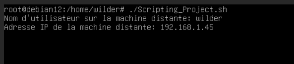
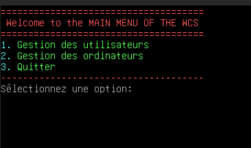
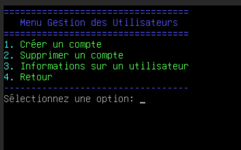
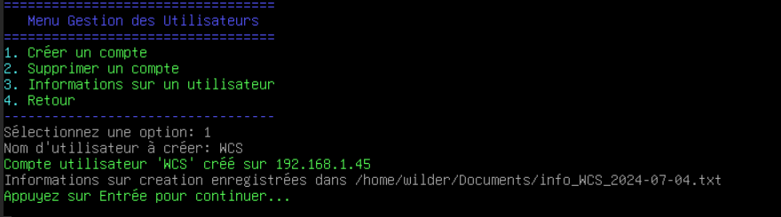
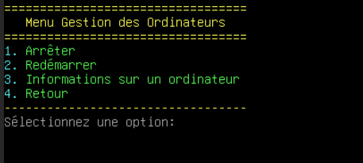
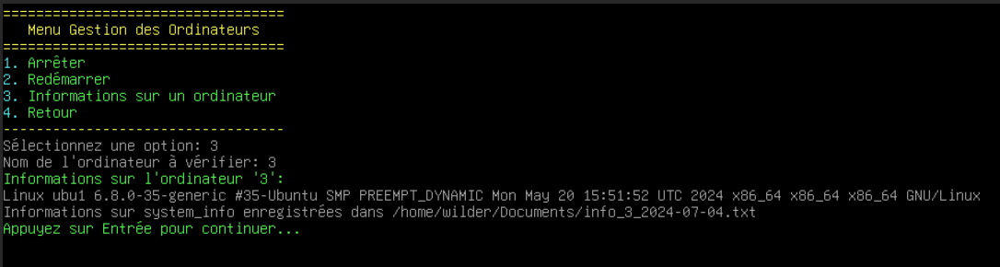
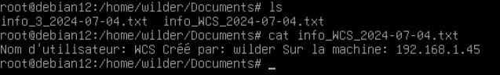

## Guide d'utilisation : Script BASH "Scripting_Project.sh" 

Le script "Scripting_Project" permet de gérer des opérations sur une machine distante via SSH.   

Suivez ces étapes pour utiliser le script efficacement :

### Étape 1 : Lancement du script

1. Ouvrez un terminal sur votre machine locale.
    
2. Assurez-vous que vous avez accès en SSH à la machine distante et que vous avez les droits nécessaires pour exécuter les commandes `sudo`.
    
3. Placez-vous dans le répertoire où se trouve le script "Scripting_Project" en utilisant la commande `cd` si nécessaire.
    
4. Lancez le script en exécutant la commande suivante :

```bash
./Scripting_Project.sh
```


Cela démarrera le script et vous demandra les informations de connexion.


### Étape 2 : Connexion à la machine distante

1. Lorsque vous êtes invité, saisissez le nom d'utilisateur sur la machine distante (`remote_user`) et l'adresse IP de la machine distante (`remote_ip`).
   
    

2. Appuyez sur Entrée pour confirmer, le menu ci-dessous s'affiche :  
   
### Étape 3 : Utilisation du menu principal
 

1. Sélectionnez une option en entrant le numéro correspondant et appuyez sur Entrée, ici le sous menu pour l'option 1 :

 

### Étape 4 : Gestion des utilisateurs

- Choisissez une action parmi les options, disponibles et suivez les instructions à l'écran, ici l'option 1
  

    
- Après chaque action, un message indiquant le succès ou l'échec de l'opération sera affiché.
- Appuyez sur Entrée pour revenir au menu des utilisateurs après chaque action.
- Appuyer sur l'option 4 pour revenir au menu principal
 
### Étape 5 : Gestion des ordinateurs  

le sous menu pour l'option 2 du menu principal :  



1. Choisissez une action parmi les options disponibles et suivez les instructions à l'écran, ici l'option 3 : 


    
2. Après chaque action, un message indiquant le succès ou l'échec de l'opération sera affiché.
    
3. Appuyez sur Entrée pour revenir au menu des ordinateurs après chaque action.
    
### Étape 6 : Quitter le script

1. Sélectionnez l'option **Quitter** dans le menu principal pour terminer l'exécution du script.
    
2. Le script enregistrera la fin de l'exécution dans le fichier de journalisation spécifié (`/var/log/log_evt.log`).
     


3. Le script enregistrera les informations recueilli sur la cible dans le `/home/wilder/Documents`
    
  

### Utilisation avancée

1. **Utilisation optimale des options** :
    
    - Utilisez les informations enregistrées dans les fichiers (`home/wilder/Documents`) pour un suivi détaillé des utilisateurs et des ordinateurs.
    - Personnalisez les commandes SSH dans le script pour répondre aux besoins spécifiques de votre environnement.
2. **Personnalisation du script** :
    
    - Modifiez les variables globales (`log_file`, `info_dir`) pour adapter les chemins et les fichiers de journalisation selon vos préférences.
3. **Gestion des erreurs** :
    
    - En cas d'erreurs lors des opérations, consultez le fichier de journalisation (`/var/log/log_evt.log`) pour des détails supplémentaires.

---

### FAQ 


**Q : Comment vérifier si le script a réussi à se connecter à la machine distante via SSH ?**

**R :** Assurez-vous que les informations d'identification (`remote_user` et `remote_ip`) sont correctes et que vous avez accès à la machine distante depuis votre réseau local. Vérifiez également les erreurs éventuelles dans le fichier de journalisation (`/var/log/log_evt.log`) pour des messages d'erreur de connexion.

**Q : Pourquoi les opérations échouent-elles parfois lors de la création ou suppression de comptes utilisateurs ?**

**R :** Assurez-vous que le nom d'utilisateur entré est valide et qu'il n'existe pas déjà sur la machine distante. Vérifiez également les droits d'administration (`sudo`) et les permissions SSH pour l'utilisateur distant.

**Q : Comment obtenir des informations spécifiques sur un utilisateur ou un ordinateur ?**

**R :** Utilisez les options correspondantes dans les menus pour saisir le nom d'utilisateur ou de l'ordinateur dont vous avez besoin. Les informations seront ensuite enregistrées dans les fichiers spécifiés (`/home/wilder/Documents`).

**Q : Est-il possible de personnaliser les actions ou les messages du script ?**

**R :** Oui, vous pouvez modifier les messages affichés, les commandes SSH et les chemins de fichiers dans le script pour répondre à vos besoins spécifiques.

**Q : Que faire si le script semble ne pas répondre ou se bloque pendant une opération ?**

**R :** Vérifiez la console ou le terminal où le script est en cours d'exécution pour tout message d'erreur. Si le script semble gelé, vous pouvez essayer d'interrompre son exécution en utilisant `Ctrl + C` dans le terminal. Analysez ensuite les messages de journalisation pour identifier la cause du problème.

## Guide d'utilisation du Script Powershell

### Menu principal :

#### Ici 3 options s'offrent à vous :

- Vous pouvez aller dans le menu "Utilisateur" en tapant `1` si vous voulez cibler un utilisateur.
- Vous pouvez aussi aller dans le menu "Ordinateur" en tapant `2` si vous voulez cibler un ordinateur
- Vous pouvez tapez `3` pour quitter le script.


### Menu Utilisateur

#### Dans le menu "Utilisateur" : 

- Vous pouvez "Créer un compte utilisateur" en tapant `1` qui va vous créer un utilisateur du nom que vous souhaitez localement sur votre ordinateur.
- Vous pouvez "Supprimez un compte utilisateur" en tapant `2` ( il faut le nom de l'utilisateur exacte pour le faire ) .
- Vous pouvez aussi  "Obtenir la date de derniere connexion" d'un utilisateur souhaité en tapant `3`
- Vous pouvez faire "Retour" en tapant `4`.


#### Dans le menu "Ordinateur" : 

- Vous pouvez "Arrêter l'ordinateur" souhaité en tapant `1` (avec l'IP ou le nom de l'ordinateur) .
- Vous pouvez "Redémarrer l'ordinateur" souhaité en tapant `2` (avec l'IP ou le nom de l'ordinateur) .
- Vous pouvez aussi  "Obtenir la version de l'OS" de l'ordinateur cible en tapant `3` (avec l'IP ou le nom de l'ordinateur)
- Vous pouvez faire "Retour" en tapant `4`.


### FAQ 

**1. Que faire si le script ne parvient pas à créer un compte utilisateur ?**

Assurez-vous que le nom d'utilisateur spécifié est unique et conforme aux règles de création de comptes sur votre système. Vérifiez également que vous disposez des privilèges nécessaires pour créer des comptes locaux.

**2. Comment éviter les erreurs de spécification d'ordinateur lors d'une opération à distance ?**

Utilisez l'adresse IP ou le nom de l'ordinateur correctement pour garantir une connexion valide et stable. Assurez-vous que l'ordinateur cible est accessible sur le réseau et que les autorisations appropriées sont en place.

**3. Que faire si le script ne parvient pas à redémarrer un ordinateur distant ?**

Vérifiez que l'ordinateur cible est allumé, connecté au réseau et accessible à distance. Assurez-vous également que vous avez les droits nécessaires pour exécuter des commandes de redémarrage à distance.

**4. Comment sécuriser l'exécution automatisée de ce script ?**

Utilisez des comptes d'utilisateur avec les privilèges minimisés nécessaires et configurez le Planificateur de tâches de Windows pour exécuter le script à des heures spécifiques. Limitez l'accès aux scripts et aux systèmes pour minimiser les risques de sécurité.

**5. Que faire en cas de messages d'erreur imprévus lors de l'exécution du script ?**

Consultez les détails du message d'erreur dans PowerShell pour identifier la cause du problème. Vérifiez la syntaxe des commandes et assurez-vous que toutes les dépendances requises sont satisfaites, telles que les modules PowerShell et les autorisations d'accès.


