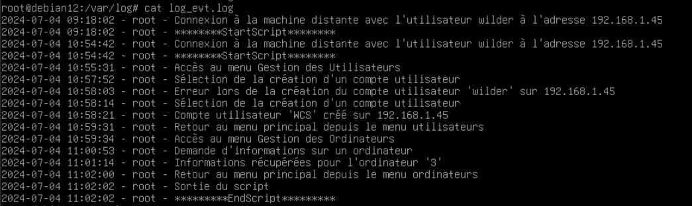

## Guide d'utilisation du script BASH "Scripting_Project" 

Le script "Scripting_Project" permet de gérer des opérations sur une machine distante via SSH. Suivez ces étapes pour utiliser le script efficacement :

### Étape 1 : Lancement du script

1. Ouvrez un terminal sur votre machine locale.
    
2. Assurez-vous que vous avez accès en SSH à la machine distante et que vous avez les droits nécessaires pour exécuter les commandes `sudo`.
    
3. Placez-vous dans le répertoire où se trouve le script "Scripting_Project" en utilisant la commande `cd` si nécessaire.
    
4. Lancez le script en exécutant la commande suivante :

```bash
./Scripting_Project
```


Cela démarrera le script et vous demandra les informations de connexion.


### Étape 2 : Connexion à la machine distante

1. Lorsque vous êtes invité, saisissez le nom d'utilisateur sur la machine distante (`remote_user`) et l'adresse IP de la machine distante (`remote_ip`).
   
    

2. Appuyez sur Entrée pour confirmer, le menu ci-dessous s'affiche :  
   
### Étape 3 : Utilisation du menu principal
 

1. Sélectionnez une option en entrant le numéro correspondant et appuyez sur Entrée, ici le sous menu pour l'option 1 :

 

### Étape 4 : Gestion des utilisateurs

- Choisissez une action parmi les options, disponibles et suivez les instructions à l'écran, ici l'option 1
  

    
- Après chaque action, un message indiquant le succès ou l'échec de l'opération sera affiché.
- Appuyez sur Entrée pour revenir au menu des utilisateurs après chaque action.
- Appuyer sur l'option 4 pour revenir au menu principal
 
### Étape 5 : Gestion des ordinateurs  

le sous menu pour l'option 2 du menu principal :  


1. Choisissez une action parmi les options disponibles et suivez les instructions à l'écran, ici l'option 3 : 


    
2. Après chaque action, un message indiquant le succès ou l'échec de l'opération sera affiché.
    
3. Appuyez sur Entrée pour revenir au menu des ordinateurs après chaque action.
    
### Étape 6 : Quitter le script

1. Sélectionnez l'option **Quitter** dans le menu principal pour terminer l'exécution du script.
    
2. Le script enregistrera la fin de l'exécution dans le fichier de journalisation spécifié (`/var/log/log_evt.log`).
     


3. Le script enregistrera les informations recueilli sur la cible dans le `/home/wilder/Documents`
    
  

### Utilisation avancée

1. **Utilisation optimale des options** :
    
    - Utilisez les informations enregistrées dans les fichiers (`home/wilder/Documents`) pour un suivi détaillé des utilisateurs et des ordinateurs.
    - Personnalisez les commandes SSH dans le script pour répondre aux besoins spécifiques de votre environnement.
2. **Personnalisation du script** :
    
    - Modifiez les variables globales (`log_file`, `info_dir`) pour adapter les chemins et les fichiers de journalisation selon vos préférences.
3. **Gestion des erreurs** :
    
    - En cas d'erreurs lors des opérations, consultez le fichier de journalisation (`/var/log/log_evt.log`) pour des détails supplémentaires.

---

### FAQ (Foire Aux Questions)


**Q : Comment vérifier si le script a réussi à se connecter à la machine distante via SSH ?**

**R :** Assurez-vous que les informations d'identification (`remote_user` et `remote_ip`) sont correctes et que vous avez accès à la machine distante depuis votre réseau local. Vérifiez également les erreurs éventuelles dans le fichier de journalisation (`/var/log/log_evt.log`) pour des messages d'erreur de connexion.

**Q : Pourquoi les opérations échouent-elles parfois lors de la création ou suppression de comptes utilisateurs ?**

**R :** Assurez-vous que le nom d'utilisateur entré est valide et qu'il n'existe pas déjà sur la machine distante. Vérifiez également les droits d'administration (`sudo`) et les permissions SSH pour l'utilisateur distant.

**Q : Comment obtenir des informations spécifiques sur un utilisateur ou un ordinateur ?**

**R :** Utilisez les options correspondantes dans les menus pour saisir le nom d'utilisateur ou de l'ordinateur dont vous avez besoin. Les informations seront ensuite enregistrées dans les fichiers spécifiés (`/home/wilder/Documents`).

**Q : Est-il possible de personnaliser les actions ou les messages du script ?**

**R :** Oui, vous pouvez modifier les messages affichés, les commandes SSH et les chemins de fichiers dans le script pour répondre à vos besoins spécifiques.

**Q : Que faire si le script semble ne pas répondre ou se bloque pendant une opération ?**

**R :** Vérifiez la console ou le terminal où le script est en cours d'exécution pour tout message d'erreur. Si le script semble gelé, vous pouvez essayer d'interrompre son exécution en utilisant `Ctrl + C` dans le terminal. Analysez ensuite les messages de journalisation pour identifier la cause du problème.
